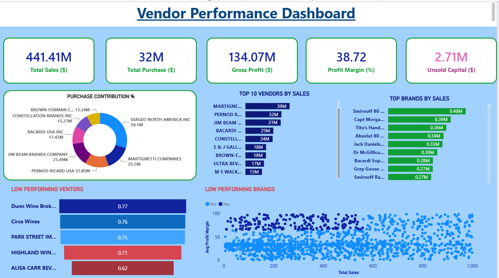

# Vendor Performance Analysis

## 📌 Project Overview

This project analyzes vendor sales performance, purchasing patterns, profitability, inventory turnover, and key business KPIs to identify high-performing vendors, underperforming vendors, and opportunities for business improvement.

The analysis was performed using Python, SQL, and Power BI, covering data cleaning, exploratory data analysis, statistical analysis, data transformation, and interactive dashboard development.

---

## 🎯 Business Objectives

The main objectives of this project are:

- Analyze vendor sales and purchase performance
- Identify top-performing and underperforming vendors
- Evaluate vendor profitability and profit margins
- Analyze inventory levels and turnover
- Identify sales and purchasing trends
- Compare vendor contribution to overall business performance
- Identify opportunities to optimize vendor management
- Support data-driven purchasing and business decisions

---

## 🛠️ Tools & Technologies

- **Python** – Data cleaning, transformation, EDA, and statistical analysis
- **Pandas & NumPy** – Data manipulation and analysis
- **Matplotlib & Seaborn** – Data visualization
- **SciPy** – Statistical analysis
- **SQL** – Data extraction and analysis
- **SQLite** – Database management
- **Power BI** – Interactive dashboard and KPI visualization
- **Jupyter Notebook** – Data analysis environment

---

## 📂 Project Structure

```text
Vendor-Performance-Analysis/
│
├── README.md
│
├── Vendor Performance Analysis.ipynb
├── Exploratory Data Analysis.ipynb
│
├── begin_inventory.csv
├── end_inventory.csv
├── purchase_prices.csv
├── vendor_invoice.csv
├── vendor_sales_summary.csv
│
├── get_vendor_summary.py
├── ingestion_db.py
│
└── POWER BI DASHBOARD FOR DATA ANALYST.pbix


Analysis Performed
Data Cleaning & Preparation
Loaded and inspected source datasets
Checked data types and data quality
Handled missing and duplicate values
Cleaned and transformed relevant data
Integrated vendor, sales, purchase, pricing, and inventory information


Exploratory Data Analysis
Vendor-wise sales analysis
Purchase and sales trend analysis
Inventory analysis
Profitability analysis
Vendor contribution analysis
Identification of high- and low-performing vendors


SQL Analysis
SQL was used to:
Extract relevant data
Combine datasets
Generate vendor-level summaries
Calculate sales and purchase metrics
Analyze vendor performance indicators


Statistical Analysis
Statistical techniques were applied to identify patterns, relationships, and significant differences within the vendor performance data.


📊 Power BI Dashboard
An interactive Power BI dashboard was developed to provide a consolidated view of vendor performance and business KPIs.

### Dashboard Preview


Dashboard Highlights
Total Sales
Total Purchase
Gross Profit
Profit Margin
Vendor Performance
Inventory Metrics
Sales Trends
Purchase Trends
Top and Bottom Vendors


💡 Business Insights
The analysis helps identify:
Vendors contributing significantly to overall sales
High-profit and low-profit vendors
Top-performing and underperforming vendors
Sales and purchasing trends
Inventory inefficiencies
Opportunities for better vendor selection and management


📈 Business Recommendations
Based on the analysis, businesses can:
Focus on high-performing vendors
Review and improve relationships with underperforming vendors
Optimize inventory levels
Improve purchasing strategies
Monitor vendor profitability regularly
Use data-driven insights for vendor selection and negotiation
Reduce inventory inefficiencies and improve stock management


🔄 Project Workflow
Raw Data
   ↓
Data Cleaning & Transformation
   ↓
SQL Data Processing
   ↓
Exploratory Data Analysis
   ↓
Statistical Analysis
   ↓
Vendor Performance Analysis
   ↓
Power BI Dashboard
   ↓
Business Insights & Recommendations


⚠️ Data Availability
Some original source files, including purchases.csv, sales.csv, and inventory.db, are not included in this repository because of GitHub file-size limitations.
The repository contains the key project notebooks, processed data, Python scripts, and Power BI dashboard required to understand the analysis workflow.


🚀 Project Outcome
This project demonstrates an end-to-end data analytics workflow using Python, SQL, and Power BI.
It showcases practical skills in:
Data Cleaning | SQL | Python | Exploratory Data Analysis | Statistical Analysis | Data Visualization | Power BI | Business Intelligence


👩‍💻 Author
Yogita Nagar
Aspiring Data Analyst
Skills: Python | SQL | Power BI | Excel | Data Analysis
